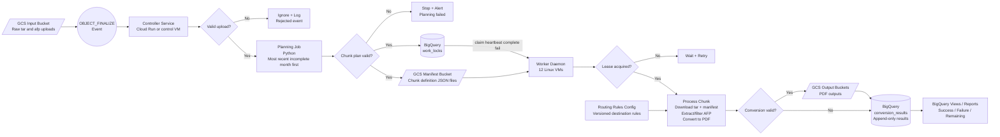

```mermaid
flowchart LR
    %% Shape conventions:
    %% [Rectangle] = compute / service
    %% [/Parallelogram/] = file storage / bucket
    %% {(Diamond)} = decision / validation
    %% ((Circle)) = event / trigger
    %% [(Database)] = BigQuery table / reporting store

    A[/GCS Input Bucket<br/>Raw tar and afp uploads/]
    B((OBJECT_FINALIZE<br/>Event))
    C[Controller Service<br/>Cloud Run or control VM]
    D{Valid upload?}
    X[Ignore + Log<br/>Rejected event]

    E[Planning Job<br/>Python<br/>Most recent incomplete month first]
    F{Chunk plan valid?}
    Y[Stop + Alert<br/>Planning failed]
    G[/GCS Manifest Bucket<br/>Chunk definition JSON files/]
    H[(BigQuery<br/>work_locks)]

    I[Worker Daemon<br/>12 Linux VMs]
    J{Lease acquired?}
    Z[Wait + Retry]
    R[Routing Rules Config<br/>Versioned destination rules]
    K[Process Chunk<br/>Download tar + manifest<br/>Extract/filter AFP<br/>Convert to PDF]
    L{Conversion valid?}
    M[/GCS Output Buckets<br/>PDF outputs/]
    N[(BigQuery<br/>conversion_results<br/>Append-only results)]

    O[BigQuery Views / Reports<br/>Success / Failure / Remaining]

    A --> B --> C --> D
    D -- Yes --> E
    D -- No --> X

    E --> F
    F -- Yes --> G
    F -- Yes --> H
    F -- No --> Y

    H -->|claim heartbeat complete fail| I
    G --> I
    I --> J
    J -- Yes --> K
    J -- No --> Z

    R --> K
    K --> L
    L -- Yes --> M --> N
    L -- No --> N

    N --> O
```