# Deployment / Runtime Topology Diagram

```mermaid
flowchart TB
    %% Shape conventions:
    %% [Rectangle] = compute / service
    %% [/Parallelogram/] = file storage / bucket
    %% {Diamond} = decision / validation
    %% ((Circle)) = event / trigger
    %% [(Database)] = BigQuery table / reporting store
    %% {{Hexagon}} = service account / IAM

    subgraph GCP["Google Cloud Platform - Project: afp-pipeline-prod"]
        
        subgraph Storage["Cloud Storage"]
            A[/Input Bucket<br/>gs://afp-input<br/>Source tar files/]
            B[/Manifest Bucket<br/>gs://afp-input/manifests<br/>Chunk definition JSON/]
            C[/Output Bucket - Residential<br/>gs://afp-output-residential<br/>PDF outputs/]
            D[/Output Bucket - Business<br/>gs://afp-output-business<br/>PDF outputs/]
            E[/Output Bucket - Archive<br/>gs://afp-output-archive<br/>PDF outputs/]
        end

        subgraph BigQuery["BigQuery Dataset: afp_pipeline"]
            F[(work_locks<br/>Chunk coordination)]
            G[(conversion_results<br/>Append-only results)]
            H[Views<br/>vw_month_progress<br/>vw_chunk_progress<br/>vw_worker_throughput<br/>vw_stale_and_retried_chunks]
        end

        subgraph Compute["Compute Engine - us-central1"]
            subgraph ControlPlane["Control Plane"]
                I[Controller VM<br/>afp-controller-01<br/>Runs planner job]
            end

            subgraph WorkerFleet["Worker Fleet - 12 VMs"]
                J[Worker VM 01<br/>afp-worker-01<br/>Python daemon]
                K[Worker VM 02<br/>afp-worker-02<br/>Python daemon]
                L[Worker VM 03<br/>afp-worker-03<br/>Python daemon]
                M[Worker VM 04-12<br/>afp-worker-04..12<br/>Python daemons]
            end
        end

        subgraph IAM["Service Accounts & IAM"]
            N{{Planner SA<br/>afp-planner@<br/>project.iam}}
            O{{Worker SA<br/>afp-worker@<br/>project.iam}}
            P{{Admin SA<br/>afp-admin@<br/>project.iam}}
        end

        subgraph Monitoring["Cloud Monitoring & Logging"]
            Q[Cloud Logging<br/>Worker logs<br/>Planner logs]
            R[Cloud Monitoring<br/>VM metrics<br/>Custom metrics]
        end
    end

    subgraph External["External Systems"]
        S[Source Data Provider<br/>Uploads tar files]
        T[Downstream Consumers<br/>Read PDF outputs]
        U[Operations Team<br/>SSH access, monitoring]
    end

    %% Data flow
    S -->|Upload tar files| A
    I -->|Read tar inventory| A
    I -->|Write manifests| B
    I -->|Seed work_locks| F

    J -->|Claim chunks| F
    K -->|Claim chunks| F
    L -->|Claim chunks| F
    M -->|Claim chunks| F

    J -->|Read manifests| B
    K -->|Read manifests| B
    L -->|Read manifests| B
    M -->|Read manifests| B

    J -->|Read tar files| A
    K -->|Read tar files| A
    L -->|Read tar files| A
    M -->|Read tar files| A

    J -->|Write PDFs| C
    J -->|Write PDFs| D
    J -->|Write PDFs| E
    K -->|Write PDFs| C
    K -->|Write PDFs| D
    K -->|Write PDFs| E
    L -->|Write PDFs| C
    L -->|Write PDFs| D
    L -->|Write PDFs| E
    M -->|Write PDFs| C
    M -->|Write PDFs| D
    M -->|Write PDFs| E

    J -->|Write results| G
    K -->|Write results| G
    L -->|Write results| G
    M -->|Write results| G

    F --> H
    G --> H

    C --> T
    D --> T
    E --> T

    %% IAM relationships
    I -.->|Uses| N
    J -.->|Uses| O
    K -.->|Uses| O
    L -.->|Uses| O
    M -.->|Uses| O

    N -.->|Read| A
    N -.->|Write| B
    N -.->|Write| F

    O -.->|Read| A
    O -.->|Read| B
    O -.->|Read/Write| F
    O -.->|Write| C
    O -.->|Write| D
    O -.->|Write| E
    O -.->|Write| G

    P -.->|Admin access| F
    P -.->|Admin access| G

    %% Monitoring
    I -->|Logs| Q
    J -->|Logs| Q
    K -->|Logs| Q
    L -->|Logs| Q
    M -->|Logs| Q

    I -->|Metrics| R
    J -->|Metrics| R
    K -->|Metrics| R
    L -->|Metrics| R
    M -->|Metrics| R

    U -->|SSH| I
    U -->|SSH| J
    U -->|SSH| K
    U -->|SSH| L
    U -->|SSH| M
    U -->|Query| H
    U -->|View| Q
    U -->|View| R

    style GCP fill:#e8f5e9
    style Storage fill:#fff9c4
    style BigQuery fill:#f3e5f5
    style Compute fill:#e1f5ff
    style ControlPlane fill:#b3e5fc
    style WorkerFleet fill:#b3e5fc
    style IAM fill:#ffe0b2
    style Monitoring fill:#d1c4e9
    style External fill:#ffccbc
    style A fill:#fff9c4
    style B fill:#fff9c4
    style C fill:#c8e6c9
    style D fill:#c8e6c9
    style E fill:#c8e6c9
    style F fill:#ce93d8
    style G fill:#ce93d8
    style H fill:#ba68c8
    style I fill:#81d4fa
    style J fill:#4fc3f7
    style K fill:#4fc3f7
    style L fill:#4fc3f7
    style M fill:#4fc3f7
    style N fill:#ffcc80
    style O fill:#ffcc80
    style P fill:#ffcc80
```



## Topology Overview

### GCP Project Structure

**Project**: `afp-pipeline-prod`

**Region**: `us-central1` (primary)

**Components**:

- 3-5 GCS buckets (input, manifests, outputs)
- 1 BigQuery dataset with 2 tables and 4+ views
- 13 Compute Engine VMs (1 controller, 12 workers)
- 3 service accounts (planner, worker, admin)
- Cloud Logging and Cloud Monitoring

## Storage Layer

### Input Bucket

**Name**: `gs://afp-input`

**Purpose**: Store source tar files uploaded by data provider

**Structure**:

```
gs://afp-input/
├── monthly/
│   ├── 2026-03/
│   │   ├── day-01.tar
│   │   ├── day-02.tar
│   │   └── ...
│   ├── 2026-02/
│   └── ...
└── manifests/
    ├── 2026-03/
    │   ├── 2026-03-01_2026-03-03/
    │   │   ├── chunk-0000.json
    │   │   ├── chunk-0001.json
    │   │   └── ...
    │   └── ...
    └── ...
```

**Lifecycle Policy**:

- Retain source tar files for 90 days
- Move to Nearline storage after 30 days
- Retain manifests for 180 days

**IAM**:

- Planner SA: `roles/storage.objectViewer` (read tar files)
- Planner SA: `roles/storage.objectCreator` (write manifests)
- Worker SA: `roles/storage.objectViewer` (read tar files and manifests)
- Data Provider: `roles/storage.objectCreator` (upload tar files)

### Output Buckets

**Residential Bucket**: `gs://afp-output-residential`

**Business Bucket**: `gs://afp-output-business`

**Archive Bucket**: `gs://afp-output-archive`

**Purpose**: Store generated PDF outputs, routed by business rules

**Structure** (example for residential):

```
gs://afp-output-residential/
├── invoices/
│   ├── 2026-03/
│   │   ├── 2026-03-01/
│   │   │   ├── 10000001_20260301.pdf
│   │   │   ├── 10000002_20260301.pdf
│   │   │   └── ...
│   │   └── ...
│   └── ...
└── ...
```

**Lifecycle Policy**:

- Retain PDFs indefinitely (or per business requirements)
- Move to Coldline storage after 365 days

**IAM**:

- Worker SA: `roles/storage.objectCreator` (write PDFs)
- Downstream Consumers: `roles/storage.objectViewer` (read PDFs)

## BigQuery Layer

### Dataset

**Name**: `afp_pipeline`

**Location**: `us-central1` (same as compute)

**Tables**:

1. `work_locks` - Chunk coordination table
2. `conversion_results` - Append-only results table

**Views**:

1. `vw_month_progress` - Monthly progress summary
2. `vw_chunk_progress` - Per-chunk status
3. `vw_worker_throughput` - Worker performance
4. `vw_stale_and_retried_chunks` - Operational issues

**IAM**:

- Planner SA: `roles/bigquery.dataEditor` (write work_locks)
- Worker SA: `roles/bigquery.dataEditor` (read/write work_locks, write conversion_results)
- Admin SA: `roles/bigquery.admin` (full access for operations)
- Operations Team: `roles/bigquery.jobUser` + `roles/bigquery.dataViewer` (query views)

## Compute Layer

### Controller VM

**Name**: `afp-controller-01`

**Machine Type**: `n1-standard-2` (2 vCPU, 7.5 GB memory)

**Purpose**: Run planner job on schedule or on-demand

**OS**: Debian 11 or Ubuntu 20.04 LTS

**Software**:

- Python 3.9+
- `google-cloud-storage`
- `google-cloud-bigquery`
- Planner Python application
- Cron or systemd timer for scheduling

**Service Account**: `afp-planner@project.iam.gserviceaccount.com`

**Network**: VPC with private IP, Cloud NAT for outbound

**Disk**: 50 GB standard persistent disk

### Worker VMs

**Names**: `afp-worker-01` through `afp-worker-12`

**Machine Type**: `n1-standard-4` (4 vCPU, 15 GB memory)

**Purpose**: Run worker daemon to process chunks

**OS**: Debian 11 or Ubuntu 20.04 LTS

**Software**:

- Python 3.9+
- `google-cloud-storage`
- `google-cloud-bigquery`
- Worker Python application
- AFP-to-PDF converter binary
- systemd service for worker daemon

**Service Account**: `afp-worker@project.iam.gserviceaccount.com`

**Network**: VPC with private IP, Cloud NAT for outbound

**Disk**: 100 GB standard persistent disk (for local tar extraction and PDF generation)

**Startup Script**: Installs dependencies, configures worker service, starts worker daemon

## Service Accounts

### Planner Service Account

**Email**: `afp-planner@project.iam.gserviceaccount.com`

**Purpose**: Used by controller VM to run planner job

**Permissions**:

- `roles/storage.objectViewer` on input bucket (read tar files)
- `roles/storage.objectCreator` on manifest bucket (write manifests)
- `roles/bigquery.dataEditor` on `afp_pipeline` dataset (write work_locks)
- `roles/logging.logWriter` (write logs)

### Worker Service Account

**Email**: `afp-worker@project.iam.gserviceaccount.com`

**Purpose**: Used by worker VMs to process chunks

**Permissions**:

- `roles/storage.objectViewer` on input bucket (read tar files and manifests)
- `roles/storage.objectCreator` on output buckets (write PDFs)
- `roles/bigquery.dataEditor` on `afp_pipeline` dataset (read/write work_locks, write conversion_results)
- `roles/logging.logWriter` (write logs)

### Admin Service Account

**Email**: `afp-admin@project.iam.gserviceaccount.com`

**Purpose**: Used by operations team for administrative tasks

**Permissions**:

- `roles/bigquery.admin` on `afp_pipeline` dataset (full access)
- `roles/storage.admin` on all buckets (full access)
- `roles/compute.instanceAdmin.v1` (manage VMs)

## IAM Boundaries

### Principle of Least Privilege

Each service account has only the permissions needed for its role:

- Planner cannot write to output buckets
- Workers cannot write to manifest bucket
- Workers cannot delete or modify source tar files

### Separation of Concerns

- Planner SA and Worker SA are separate
- Admin SA is separate from runtime SAs
- Operations team uses Admin SA for manual tasks, not runtime SAs

### Network Security

- VMs use private IPs only
- Cloud NAT for outbound internet access (e.g., package updates)
- No public IPs on VMs
- SSH access via IAP tunnel or bastion host

## Monitoring and Logging

### Cloud Logging

**Log Sources**:

- Controller VM: planner job logs
- Worker VMs: worker daemon logs
- BigQuery: query logs (optional)

**Log Retention**: 30 days (default), 90 days (recommended)

**Log Sinks** (optional):

- Export to Cloud Storage for long-term retention
- Export to BigQuery for log analysis

### Cloud Monitoring

**Metrics**:

- VM CPU, memory, disk utilization
- Custom metrics: chunks processed, conversions per hour, failure rate
- BigQuery query performance

**Dashboards**:

- Worker fleet health
- Monthly progress
- Failure analysis

**Alerts**:

- VM down or unhealthy
- High failure rate
- Stale leases
- No progress in last hour

## Network Topology

### VPC Network

**Name**: `afp-pipeline-vpc`

**Subnets**:

- `afp-subnet-us-central1` (10.0.0.0/24)

**Firewall Rules**:

- Allow SSH from IAP (35.235.240.0/20)
- Allow internal communication between VMs
- Deny all other inbound traffic

**Cloud NAT**:

- Provides outbound internet access for VMs
- No public IPs on VMs

### DNS

**Internal DNS**: VMs resolve each other by name within VPC

**External DNS**: Not required for v1

## Deployment Architecture

### Terraform Modules

Recommended Terraform structure:

```
infrastructure/terraform/
├── main.tf
├── variables.tf
├── outputs.tf
├── modules/
│   ├── storage_bucket/
│   ├── bigquery/
│   ├── compute_instance/
│   └── service_account/
```

### Deployment Order

1. Create service accounts
2. Create VPC network and subnets
3. Create Cloud NAT
4. Create GCS buckets
5. Create BigQuery dataset and tables
6. Create controller VM
7. Create worker VMs
8. Configure IAM bindings
9. Deploy application code
10. Start services

### Configuration Management

**Routing Rules Config**: Deployed with worker code, versioned in Git

**Planner Config**: Environment variables or config file on controller VM

**Worker Config**: Environment variables or config file on worker VMs

## Scaling Considerations

### Current Scale

- 12 worker VMs
- ~60-120 chunks per month
- ~25,000 BANs per chunk
- ~1 month per day throughput target

### Scaling Up

To increase throughput:

1. Add more worker VMs (e.g., 24 workers)
2. Increase chunk count (e.g., 240 chunks per month)
3. Increase VM machine type (e.g., n1-standard-8)

### Scaling Down

To reduce costs during low activity:

1. Stop worker VMs when no work is available
2. Use preemptible VMs for workers (with retry logic)
3. Reduce VM machine type during off-peak

## High Availability

### Current Design

- Single controller VM (acceptable for v1)
- 12 worker VMs (redundancy through fleet size)
- BigQuery and GCS are highly available by default

### Failure Scenarios

- **Controller VM failure**: Planner job doesn't run, but workers continue processing existing chunks
- **Worker VM failure**: Other workers reclaim stale leases and continue
- **BigQuery outage**: All processing stops, resumes when BigQuery recovers
- **GCS outage**: All processing stops, resumes when GCS recovers

### Improvements for v2

- Active/standby controller VMs with leader election
- Auto-scaling worker fleet based on chunk backlog
- Multi-region deployment for disaster recovery

## Cost Optimization

### Compute Costs

- Use preemptible VMs for workers (60-80% cost savings)
- Stop workers when no work is available
- Right-size VM machine types based on actual resource usage

### Storage Costs

- Use lifecycle policies to move old data to Nearline/Coldline
- Delete temporary files after processing
- Compress tar files if possible

### BigQuery Costs

- Partition tables by date for query efficiency
- Cluster tables by frequently filtered columns
- Use views instead of materialized tables where possible
- Monitor query costs and optimize expensive queries

## Related Documents

- [`architecture.md`](../architecture.md): Overall system architecture
- [`bigquery-schema.md`](../bigquery-schema.md): Table schemas and IAM requirements
- [`runbook.md`](../runbook.md): Operational procedures
- Terraform modules: `infrastructure/terraform/`