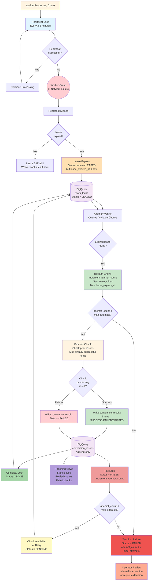

# Failure / Retry Flow Diagram

## Flow Description

### 1. Normal Processing With Heartbeat

A worker claims a chunk and begins processing:

- the worker starts a heartbeat loop that runs every 3-5 minutes
- each heartbeat updates `work_locks.updated_at` and extends `lease_expires_at`
- the worker continues processing while heartbeats succeed

### 2. Worker Crash or Network Failure

If the worker crashes or loses network connectivity:

- heartbeats stop
- the worker cannot update the lease
- the lease expiry timestamp (`lease_expires_at`) passes

### 3. Lease Expiry Detection

The lease expires when `lease_expires_at < CURRENT_TIMESTAMP()`:

- the chunk row remains in `LEASED` status
- but the lease is now stale and eligible for reclaim
- the crashed worker (if it recovers) should detect it no longer owns the lease and stop processing

### 4. Chunk Reclaim

Another worker queries for available chunks:

- the query includes chunks with expired leases
- the worker reclaims the chunk by:
  - incrementing `attempt_count`
  - generating a new `lease_token`
  - setting a new `lease_expires_at`
  - updating `worker_id` to the new worker
  - keeping `status = LEASED`

### 5. Retry Limit Check

Before processing, the worker checks `attempt_count < max_attempts`:

- if under the limit, proceed with processing
- if at or over the limit, mark the chunk as terminally failed

### 6. Idempotent Retry Processing

The reclaiming worker processes the chunk:

- downloads the manifest
- checks `conversion_results` for prior successful outputs
- skips already successful items (writes `SKIPPED` status)
- processes remaining items
- writes new `conversion_results` rows

### 7. Chunk Completion Paths

#### Success Path

If the chunk completes successfully:

- write `conversion_results` rows with `SUCCESS` status
- complete the lock row with `status = DONE`
- set `completed_at` timestamp
- clear `lease_token` and `lease_expires_at`

#### Partial Success Path

If some items succeed and some fail:

- write `SUCCESS` rows for successful items
- write `FAILED` rows for failed items
- fail the lock row with `status = FAILED`
- increment `attempt_count`

#### Failure Path

If the chunk fails entirely:

- write `FAILED` rows for all attempted items
- fail the lock row with `status = FAILED`
- increment `attempt_count`

### 8. Retry Eligibility

After a chunk fails:

- if `attempt_count < max_attempts`, the chunk becomes available for retry
- the chunk status may be set to `PENDING` or remain `FAILED` with expired lease
- another worker can reclaim it

### 9. Terminal Failure

If `attempt_count >= max_attempts`:

- the chunk is marked with `status = FAILED`
- the chunk is not eligible for automatic retry
- operator review is required

### 10. Operator Intervention

For terminally failed chunks, operators can:

- review `conversion_results` to understand failure patterns
- investigate source data quality issues
- manually reset `attempt_count` and `status` to allow retry
- mark the chunk as permanently skipped if appropriate

### 11. Reporting and Observability

The `conversion_results` table and reporting views provide visibility into:

- stale leases (chunks with expired `lease_expires_at`)
- retried chunks (chunks with `attempt_count > 1`)
- failed chunks (chunks with `status = FAILED`)
- partial success patterns
- failure code distribution

## Key Scenarios

### Scenario 1: VM Crash Mid-Chunk

1. Worker VM crashes while processing chunk
2. Heartbeat stops
3. Lease expires after 10-15 minutes
4. Another worker reclaims the chunk
5. New worker checks prior `conversion_results`
6. New worker skips already successful items
7. New worker processes remaining items
8. Chunk completes or fails based on remaining work

### Scenario 2: Transient Network Failure

1. Worker loses network connectivity
2. Heartbeat fails
3. Lease expires
4. Worker regains connectivity
5. Worker detects it no longer owns the lease (lease_token mismatch)
6. Worker stops processing
7. Another worker reclaims the chunk

### Scenario 3: Repeated Chunk Failure

1. Worker claims chunk
2. Chunk fails due to bad source data
3. `attempt_count` increments to 1
4. Another worker reclaims chunk
5. Chunk fails again with same error
6. `attempt_count` increments to 2
7. Another worker reclaims chunk
8. Chunk fails a third time
9. `attempt_count` reaches `max_attempts` (3)
10. Chunk marked as terminally failed
11. Operator reviews failure pattern

### Scenario 4: Partial Chunk Success

1. Worker processes chunk with 25,000 items
2. 24,000 items succeed
3. 1,000 items fail due to converter errors
4. Worker writes 24,000 `SUCCESS` rows
5. Worker writes 1,000 `FAILED` rows
6. Worker fails the chunk lock
7. Another worker reclaims chunk
8. New worker skips the 24,000 already successful items
9. New worker retries the 1,000 failed items
10. If retry succeeds, chunk completes
11. If retry fails, chunk fails again

### Scenario 5: Stale Lease Recovery

1. Operator notices chunks with stale leases in reporting view
2. Operator confirms workers are healthy
3. Stale chunks are automatically reclaimed by workers
4. No manual intervention needed unless chunks repeatedly stale

## Failure Codes

Common failure codes written to `conversion_results`:

- `BAD_TAR`: source tar file is corrupt or unreadable
- `BAD_AFP`: AFP member is corrupt or unsupported
- `CONVERTER_ERROR`: converter binary failed
- `OUTPUT_VALIDATION_FAILED`: PDF output failed validation
- `UPLOAD_FAILED`: GCS upload failed
- `MANIFEST_ERROR`: chunk manifest is malformed
- `LEASE_LOST`: worker lost lease during processing
- `NO_ROUTING_RULE`: no routing rule matched
- `ROUTING_TEMPLATE_ERROR`: routing template variable missing
- `UNKNOWN`: unexpected error

## Retry Strategy

### Automatic Retry

- chunks with `attempt_count < max_attempts` are automatically retried
- retry happens when another worker reclaims the chunk
- no manual intervention needed

### Manual Retry

- chunks with `attempt_count >= max_attempts` require operator review
- operator can reset `attempt_count` and `status` to allow retry
- operator should investigate root cause before retry

### Retry Backoff

For v1, no explicit backoff is implemented:

- retry happens when a worker reclaims the chunk
- natural backoff occurs due to worker claim ordering and priority

For v2, consider:

- exponential backoff based on `attempt_count`
- temporary priority reduction for repeatedly failed chunks

## Idempotency Guarantees

The retry flow is safe because:

- chunk membership is deterministic (defined by manifest)
- workers check prior `conversion_results` before processing
- successful outputs are not reprocessed
- `conversion_results` is append-only (no updates)
- destination naming is deterministic

## Monitoring and Alerts

Recommended alerts:

- chunks with stale leases > 30 minutes
- chunks with `attempt_count >= 2`
- chunks with `status = FAILED` and `attempt_count >= max_attempts`
- high failure rate for specific failure codes
- workers with no successful completions in > 1 hour

## Related Documents

- [`worker-processing.md`](../worker-processing.md): Worker processing flow and responsibilities
- [`conversion-results.md`](../conversion-results.md): Result table schema and progress logic
- [`bigquery-schema.md`](../bigquery-schema.md): `work_locks` and `conversion_results` schemas
- [`architecture.md`](../architecture.md): Overall system architecture and failure handling