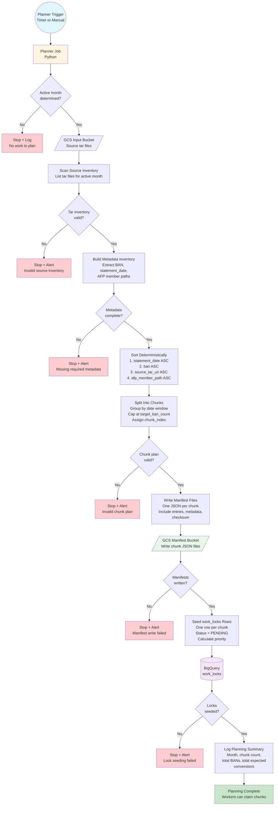

# Planner / Chunking Flow Diagram

## Flow Description

### 1. Planner Trigger

The planner job is triggered by:

- a scheduled timer (e.g., daily or on-demand)
- manual operator command
- completion of the previous active month

### 2. Determine Active Month

The planner identifies the most recent incomplete month:

- list candidate processing months in descending order
- choose the newest month with planned work that is not yet materially complete
- if no active month is found, stop and log

### 3. Scan Source Inventory

The planner scans the input bucket for tar files belonging to the active month:

- list all tar files matching the month pattern
- validate that tar files exist and are accessible
- if inventory is invalid or empty, stop and alert

### 4. Build Metadata Inventory

The planner extracts required metadata from tar files or sidecar data:

- BAN (Billing Account Number)
- statement_date (billing day)
- AFP member paths
- source tar URI
- any routing dimensions available at planning time

If required metadata is missing, stop and alert.

### 5. Sort Deterministically

The planner sorts all inventory entries using a deterministic sort order:

1. `statement_date` ascending
2. `ban` ascending
3. `source_tar_uri` ascending
4. `afp_member_path` ascending

This ensures chunk membership is stable across reruns.

### 6. Split Into Chunks

The planner groups entries into chunks:

- group by date window (e.g., 1-3 days)
- cap each chunk at `target_ban_count` (e.g., 25,000 BANs)
- assign `chunk_index` within each date window
- calculate `selected_ban_count` and `expected_conversion_count`

### 7. Validate Chunk Plan

The planner validates the chunk plan:

- no overlapping BAN membership across chunks
- no missing BANs within the planned set
- `selected_ban_count <= target_ban_count`
- `expected_conversion_count` matches entry count
- chunk count is reasonable for the worker fleet

If validation fails, stop and alert.

### 8. Write Manifest Files

The planner writes one JSON manifest file per chunk to GCS:

- include all required fields (see [`planner-and-chunking.md`](../planner-and-chunking.md))
- include full entry list with BAN, statement_date, source_tar_uri, afp_member_path
- compute and include manifest checksum
- use deterministic naming: `gs://afp-input/manifests/<month>/<date-range>/chunk-<index>.json`

If manifest write fails, stop and alert.

### 9. Seed work_locks Rows

The planner inserts one row per chunk into the `work_locks` table:

- `shard_key` = `<month>_<date-range-start>_<date-range-end>_chunk_<index>`
- `status` = `PENDING`
- `priority` = `(YYYYMM * 100000) - chunk_index`
- `ban_list_uri` = manifest GCS URI
- `metadata_json` includes processing_month, planning_run_id, expected_conversion_count, manifest_checksum, planner_version, routing_rules_version

If lock seeding fails, stop and alert.

### 10. Log Planning Summary

The planner logs a summary of the planning run:

- active month
- chunk count
- total selected BANs
- total expected conversions
- manifest checksum summary

### 11. Planning Complete

Workers can now claim chunks and begin processing.

## Key Validations

- **Idempotency**: If the same `shard_key` already exists with matching checksum, skip insert
- **Determinism**: Sorting and chunking must be repeatable
- **Completeness**: All BANs in the active month must be assigned to exactly one chunk
- **Integrity**: Manifest checksums must match planner expectations

## Error Handling

- **No Active Month**: Log and exit gracefully
- **Invalid Source Inventory**: Alert operations, do not proceed
- **Missing Metadata**: Alert operations, do not proceed
- **Chunk Plan Validation Failure**: Alert operations, do not proceed
- **Manifest Write Failure**: Alert operations, do not proceed
- **Lock Seeding Failure**: Alert operations, do not proceed

## Related Documents

- [`planner-and-chunking.md`](../planner-and-chunking.md): Detailed planner design and chunking rules
- [`bigquery-schema.md`](../bigquery-schema.md): `work_locks` table schema
- [`architecture.md`](../architecture.md): Overall system architecture