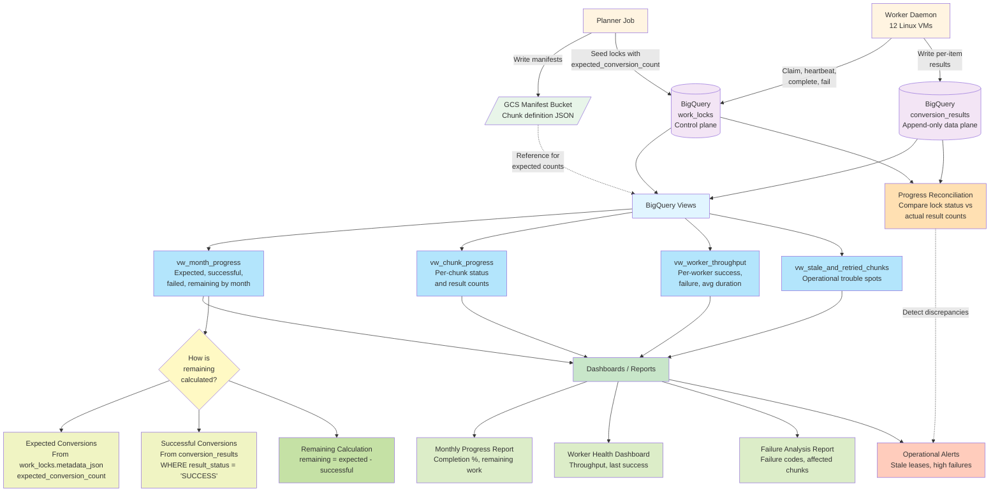

# Reporting / Progress Flow Diagram



## Flow Description

### 1. Planning Phase: Expected Work Definition

The planner defines expected work:

- writes chunk manifest files to GCS with exact entry lists
- seeds `work_locks` rows with `metadata_json` containing `expected_conversion_count`
- this establishes the baseline for "total work to be done"

**Key Point**: Expected work is defined at planning time, not derived from lock status.

### 2. Worker Processing: Actual Results Recording

Workers process chunks and record actual results:

- claim chunks from `work_locks`
- process conversion units
- write one `conversion_results` row per attempted conversion
- result status: `SUCCESS`, `FAILED`, or `SKIPPED`
- update `work_locks` status to `DONE` or `FAILED`

**Key Point**: Actual work is recorded in `conversion_results`, separate from lock state.

### 3. Reporting Views: Progress Aggregation

BigQuery views aggregate data from multiple sources:

#### `vw_month_progress`

Aggregates by month:

- `expected_conversions`: sum of `expected_conversion_count` from `work_locks.metadata_json`
- `successful_conversions`: count of `SUCCESS` rows in `conversion_results`
- `failed_attempts`: count of `FAILED` rows in `conversion_results`
- `skipped_conversions`: count of `SKIPPED` rows in `conversion_results`
- `remaining_conversions`: `expected - successful`
- `completion_pct`: `(successful / expected) * 100`

#### `vw_chunk_progress`

Aggregates by chunk:

- joins `work_locks` with `conversion_results` on `lock_id`
- shows expected count, success count, failed count, remaining count
- shows current lock status and attempt count
- useful for identifying stuck or problematic chunks

#### `vw_worker_throughput`

Aggregates by worker:

- groups `conversion_results` by `worker_id` and `processing_month`
- shows success count, failed count, average duration
- shows last success timestamp
- useful for identifying slow or stuck workers

#### `vw_stale_and_retried_chunks`

Identifies operational issues:

- chunks with expired leases (`lease_expires_at < CURRENT_TIMESTAMP()`)
- chunks with `attempt_count >= 2` (retried)
- chunks with `attempt_count >= max_attempts` (terminal failures)
- useful for proactive monitoring and alerting

### 4. Dashboards and Reports

Views feed into operational dashboards:

#### Monthly Progress Report

Shows:

- current active month
- completion percentage
- remaining work
- estimated completion time based on current throughput

#### Worker Health Dashboard

Shows:

- which workers are active
- throughput per worker
- last successful completion per worker
- workers with no recent activity (potential issues)

#### Failure Analysis Report

Shows:

- failure code distribution
- most common failure messages
- chunks with repeated failures
- source files with high failure rates

#### Operational Alerts

Triggers alerts for:

- stale leases older than threshold (e.g., 30 minutes)
- chunks with `attempt_count >= 2`
- workers with no successful completions in last hour
- high failure rate (e.g., >10% of conversions failing)
- month completion stalled (no progress in last hour)

### 5. Remaining Work Calculation

**Critical Design Point**: Remaining work is NOT calculated from lock status alone.

#### Why Lock Status Is Insufficient

Lock status tells us:

- how many chunks are `PENDING`, `LEASED`, `DONE`, or `FAILED`
- but NOT how many individual conversions succeeded or failed within each chunk

A chunk can be `DONE` but have some failed conversions inside it.
A chunk can be `FAILED` but have many successful conversions inside it.

#### Correct Remaining Calculation

```
remaining_conversions = expected_conversion_count_total - successful_conversion_count
```

Where:

- `expected_conversion_count_total` = sum of `expected_conversion_count` from all `work_locks` rows for the month
- `successful_conversion_count` = count of `SUCCESS` rows in `conversion_results` for the month

This gives accurate remaining work regardless of lock state.

### 6. Progress Reconciliation

Periodic reconciliation checks for discrepancies:

#### Expected vs Actual Comparison

Compare:

- expected conversions from planner metadata
- actual result rows in `conversion_results`
- detect missing results or unexpected extras

#### Lock Status vs Result Status Comparison

Compare:

- chunks marked `DONE` in `work_locks`
- actual success/failure counts in `conversion_results`
- detect chunks marked complete without sufficient results

#### Manifest vs Results Comparison

Compare:

- entries in chunk manifest files
- result rows in `conversion_results`
- detect missing or extra conversions

**Reconciliation Actions**:

- log discrepancies for investigation
- alert if discrepancies exceed threshold
- provide operator tools to investigate and resolve

## Key Metrics

### Primary Metrics

1. **Completion Percentage**: `(successful_conversions / expected_conversions) * 100`
2. **Remaining Work**: `expected_conversions - successful_conversions`
3. **Throughput**: `successful_conversions / elapsed_hours`
4. **Estimated Completion**: `remaining_conversions / current_throughput`

### Secondary Metrics

1. **Failure Rate**: `failed_attempts / (successful_conversions + failed_attempts)`
2. **Retry Rate**: `chunks_with_attempt_count_gt_1 / total_chunks`
3. **Worker Utilization**: `active_workers / total_workers`
4. **Average Chunk Duration**: `avg(completed_at - updated_at)` for `DONE` chunks

### Operational Metrics

1. **Stale Lease Count**: chunks with expired leases
2. **Terminal Failure Count**: chunks with `attempt_count >= max_attempts`
3. **Worker Idle Time**: time since last successful completion per worker
4. **Chunk Backlog**: count of `PENDING` chunks

## Example Queries

### Monthly Progress

```sql
SELECT
  processing_month,
  expected_conversions,
  successful_conversions,
  remaining_conversions,
  completion_pct,
  CASE
    WHEN completion_pct >= 100 THEN 'COMPLETE'
    WHEN completion_pct >= 90 THEN 'NEARLY_COMPLETE'
    WHEN completion_pct >= 50 THEN 'IN_PROGRESS'
    ELSE 'STARTED'
  END AS status
FROM `project.afp_pipeline.vw_month_progress`
ORDER BY processing_month DESC;
```

### Estimated Completion Time

```sql
WITH recent_throughput AS (
  SELECT
    processing_month,
    COUNT(*) AS recent_successes,
    TIMESTAMP_DIFF(MAX(completed_at), MIN(completed_at), HOUR) AS elapsed_hours
  FROM `project.afp_pipeline.conversion_results`
  WHERE result_status = 'SUCCESS'
    AND completed_at >= TIMESTAMP_SUB(CURRENT_TIMESTAMP(), INTERVAL 24 HOUR)
  GROUP BY processing_month
)
SELECT
  p.processing_month,
  p.remaining_conversions,
  t.recent_successes,
  t.elapsed_hours,
  SAFE_DIVIDE(t.recent_successes, t.elapsed_hours) AS conversions_per_hour,
  SAFE_DIVIDE(p.remaining_conversions, SAFE_DIVIDE(t.recent_successes, t.elapsed_hours)) AS estimated_hours_remaining
FROM `project.afp_pipeline.vw_month_progress` p
LEFT JOIN recent_throughput t
  ON p.processing_month = t.processing_month
WHERE p.remaining_conversions > 0
ORDER BY p.processing_month DESC;
```

### Worker Activity Summary

```sql
SELECT
  worker_id,
  COUNT(DISTINCT DATE(completed_at)) AS active_days,
  COUNTIF(result_status = 'SUCCESS') AS total_successes,
  COUNTIF(result_status = 'FAILED') AS total_failures,
  ROUND(AVG(TIMESTAMP_DIFF(completed_at, started_at, SECOND)), 2) AS avg_conversion_seconds,
  MAX(completed_at) AS last_activity
FROM `project.afp_pipeline.conversion_results`
WHERE completed_at >= TIMESTAMP_SUB(CURRENT_TIMESTAMP(), INTERVAL 7 DAY)
GROUP BY worker_id
ORDER BY total_successes DESC;
```

### Reconciliation Check

```sql
WITH expected AS (
  SELECT
    JSON_VALUE(metadata_json, '$.processing_month') AS processing_month,
    SUM(CAST(JSON_VALUE(metadata_json, '$.expected_conversion_count') AS INT64)) AS expected_count
  FROM `project.afp_pipeline.work_locks`
  GROUP BY 1
),
actual AS (
  SELECT
    processing_month,
    COUNT(*) AS actual_count,
    COUNTIF(result_status = 'SUCCESS') AS success_count,
    COUNTIF(result_status = 'FAILED') AS failed_count,
    COUNTIF(result_status = 'SKIPPED') AS skipped_count
  FROM `project.afp_pipeline.conversion_results`
  GROUP BY 1
)
SELECT
  e.processing_month,
  e.expected_count,
  a.actual_count,
  a.success_count,
  a.failed_count,
  a.skipped_count,
  e.expected_count - a.actual_count AS missing_results,
  CASE
    WHEN e.expected_count = a.actual_count THEN 'RECONCILED'
    WHEN e.expected_count > a.actual_count THEN 'MISSING_RESULTS'
    WHEN e.expected_count < a.actual_count THEN 'EXTRA_RESULTS'
  END AS reconciliation_status
FROM expected e
LEFT JOIN actual a
  ON e.processing_month = a.processing_month
ORDER BY e.processing_month DESC;
```

## Alerting Thresholds

Recommended alert thresholds:

### Critical Alerts

- **No worker activity in 1 hour**: No successful conversions in last hour
- **High failure rate**: >20% of conversions failing
- **Stale leases >1 hour**: Chunks with leases expired >1 hour ago
- **Month completion stalled**: No progress in last 2 hours during active processing

### Warning Alerts

- **Slow progress**: Throughput <50% of expected
- **Worker idle**: Worker with no activity in last 30 minutes
- **High retry rate**: >10% of chunks retried
- **Terminal failures**: Chunks with `attempt_count >= max_attempts`

### Informational Alerts

- **Month 90% complete**: Approaching completion
- **New month started**: Planner seeded new month
- **Worker restarted**: Worker came back online after downtime

## Dashboard Layout Recommendations

### Executive Dashboard

- Current month completion percentage (large gauge)
- Remaining work (number)
- Estimated completion time (text)
- Success/failure trend (line chart, last 7 days)

### Operations Dashboard

- Worker status grid (12 workers, green/yellow/red)
- Chunk status distribution (pie chart)
- Recent failures (table, last 50)
- Stale leases (table)

### Detailed Analytics

- Throughput by worker (bar chart)
- Failure code distribution (bar chart)
- Chunk duration distribution (histogram)
- Retry rate trend (line chart)

## Related Documents

- [`conversion-results.md`](../conversion-results.md): Result table design and progress logic
- [`bigquery-schema.md`](../bigquery-schema.md): Table schemas and view definitions
- [`runbook.md`](../runbook.md): Operational procedures and monitoring queries
- [`architecture.md`](../architecture.md): Overall system architecture